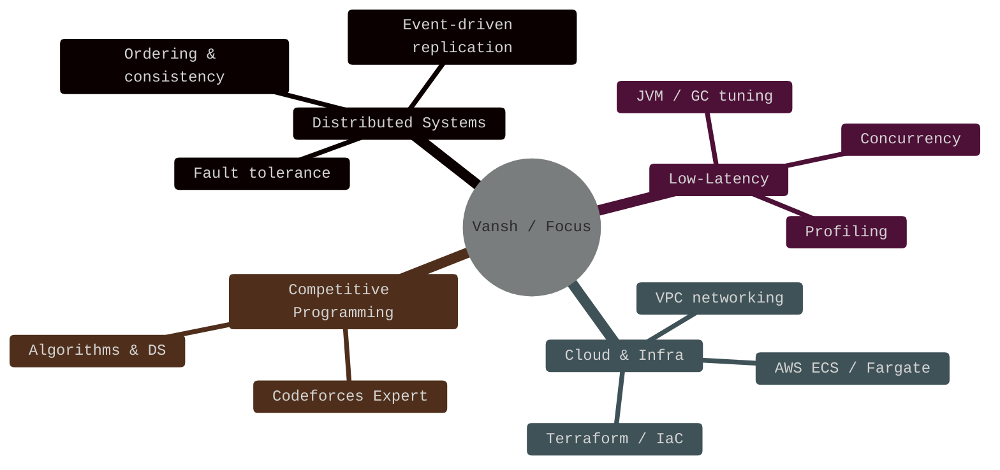
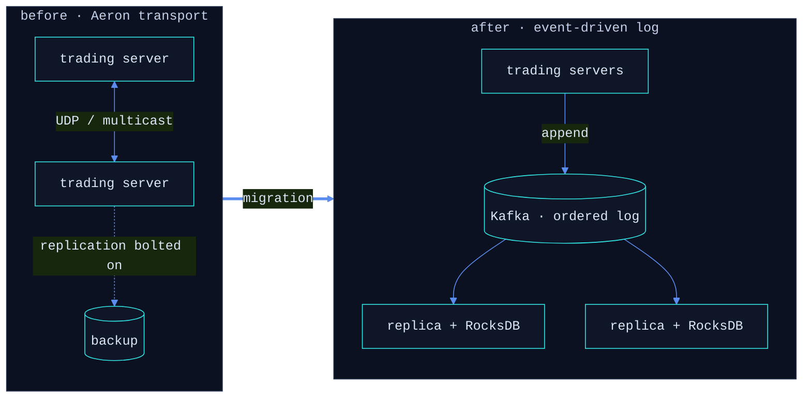
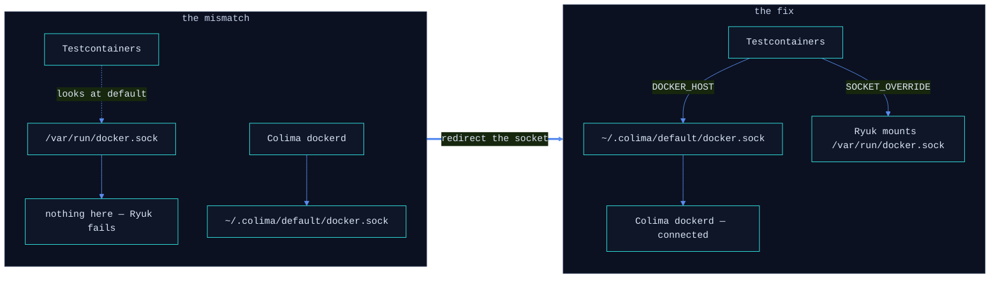
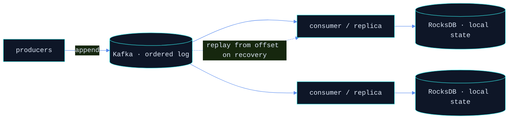

<div align="center">



<br/><br/>

<a href="https://github.com/vansh482">
  
</a>

<br/>

<a href="https://www.linkedin.com/in/vansh-vg/"></a>
<a href="https://codeforces.com/profile/vgupta"></a>
<a href="mailto:vansh012345gupta@gmail.com"></a>

</div>

---

## About Me

<table>
<tr>
<td valign="top" width="50%">

```java
final class Vansh {
    String  role     = "Backend & Distributed-Systems Engineer";
    String  company  = "Smartsheet";
    String  prev     = "Futures First — low-latency C++";

    String[] focus = {
        "fault-tolerant systems",
        "low-latency infrastructure",
        "event-driven replication"
    };

    String funFact = "I think in offsets, "
                   + "partitions, and p99s.";
}
```

</td>
<td valign="top" width="50%">

🔭 &nbsp;**Building** enterprise connectors on Java / Spring Boot, deployed on AWS (ECS Fargate)

⚡ &nbsp;**Tuning** for latency — JVM behaviour, concurrency, event-driven design

🧩 &nbsp;**Before this** — low-latency C++ trading infra at Futures First (Kafka, RocksDB, Aeron, gRPC)

🏆 &nbsp;**Codeforces Expert** (1600+) — algorithms for fun, edge cases for sport

🌱 &nbsp;**Exploring** JVM performance (GraalVM, virtual threads) & system design

📫 &nbsp;**Open to** backend / distributed-systems roles (SDE II / L4 / E4)

</td>
</tr>
</table>

<div align="center">



</div>

---

## 🎯 Current Focus



---

## Tech Stack

#### Languages


#### Frameworks & Streaming


#### Cloud & Infrastructure


#### Storage


#### Observability & Competitive Programming


---

## Featured Projects

&nbsp;**[Repo Doc Generator](https://github.com/vansh482/repo-doc-mcp-)** — AI documentation tool that keeps a codebase's docs alive. Scans a repo, uses an LLM to understand its architecture, and generates synchronized technical + non-technical docs, auto-published to Confluence and Google Docs as living pages. Exposed as an MCP server (11 tools); branch-aware with incremental regeneration; VS Code + IntelliJ extensions.
`Python` &nbsp;`MCP` &nbsp;`LLM` &nbsp;`Bedrock / OpenAI / Ollama` &nbsp;`Confluence` &nbsp;`Google Docs`

&nbsp;**[Portfolio Website](https://github.com/vansh482/portfolio-website)** — an interactive, awwwards-style portfolio with a custom magnifier-lens cursor, an x-ray reveal layer, and an ambient node-network canvas — all vanilla, no framework.
`JavaScript` &nbsp;`SVG` &nbsp;`Canvas` &nbsp;`GitHub Pages` &nbsp;[`live →`](https://vansh482.github.io/portfolio-website/)

---

## Engineering Notes

### Aeron → Kafka + RocksDB

**Context** — at Futures First, trading servers replicated state over Aeron. Blazing transport, but replay and fault-recovery were bolted on the side.

**Change** — I moved the replication path onto an event-driven log:
- **Kafka** as the durable, strictly-ordered backbone — replayable, with producers and consumers fully decoupled.
- **RocksDB** as the embedded local state store — fast point lookups and a fast cold-start recovery.

**Trade-off** — gave up a sliver of raw latency for durability and clean recovery semantics. The right call on a backup/replication path, where *never silently lose a message* beats *shave another microsecond*.



### Colima + Testcontainers on Apple Silicon

**Symptom** — on Apple Silicon with Colima as the Docker runtime, Testcontainers can't reach the daemon and Ryuk (the cleanup sidecar) refuses to start.

**The fix everyone copy-pastes** — `TESTCONTAINERS_RYUK_DISABLED=true`. It silences the error and leaves orphaned containers piling up. Wrong fix.

**Actual cause** — Testcontainers and Ryuk look for the socket at the default path; Colima publishes it somewhere else.



**Real fix — keep Ryuk on, just point it at the right socket:**

```bash
export DOCKER_HOST="unix://${HOME}/.colima/default/docker.sock"
export TESTCONTAINERS_DOCKER_SOCKET_OVERRIDE="/var/run/docker.sock"
```

### Event-driven replication — the shape I keep reaching for



Producers append to a strictly-ordered Kafka log; each replica builds local RocksDB state and recovers by replaying from its last offset. Failure handling becomes *"replay from offset"* instead of *"hope the in-flight message survived."*

---

## 🤝 Connect

<a href="https://www.linkedin.com/in/vansh-vg/"></a>
<a href="mailto:vansh012345gupta@gmail.com"></a>
<a href="https://github.com/vansh482"></a>
<!-- <a href="https://codeforces.com/profile/YOUR_CF_HANDLE"></a> -->
