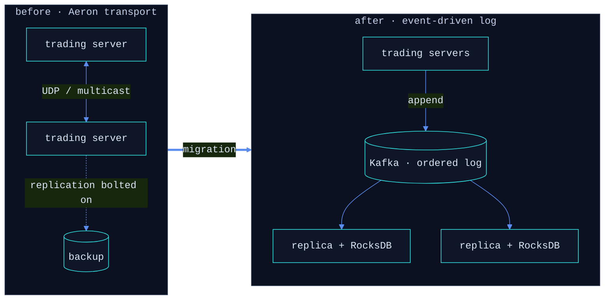
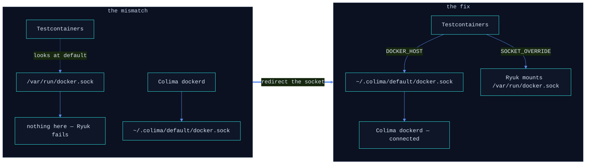
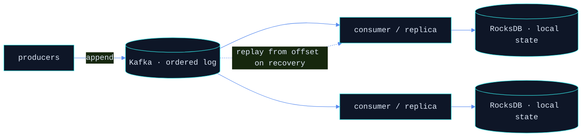

<!-- <div align="center">
  
</div>

<br/>

<div align="center">

<details>
<summary><code>vansh@dsys ~ % open ./terminal-session  </code></summary>

<br/>


</details>

</div>

<br/>

<div align="center">
  <code>vansh@dsys ~ % ping me</code>
  <br/><br/>
  <a href="https://www.linkedin.com/in/vansh-vg/"></a>
  &nbsp;&nbsp;
  <a href="mailto:vansh012345gupta@gmail.com"></a> -->
  <!-- &nbsp;&nbsp;
  <a href="https://codeforces.com/profile/YOUR_CF_HANDLE"></a> -->
<!-- </div> -->


<br/>
<br/>

<details>
<summary><code>vansh@dsys ~ % ./terminal-session</code> &nbsp; <sub>click to toggle</sub></summary>

<br/>


</details>

<details>
<summary><code>vansh@dsys ~ % ping me</code></summary>

<br/>

<a href="https://www.linkedin.com/in/vansh-vg/"></a>
&nbsp;
<a href="mailto:vansh012345gupta@gmail.com"></a>
&nbsp;
<a href="https://codeforces.com/profile/YOUR_CF_HANDLE"></a>

</details>

<details>
<summary><code>vansh@dsys ~ % notes</code></summary>

<br/>

<details>
<summary><code>cat aeron-to-kafka.md</code></summary>

<br/>

**Context** — at Futures First, trading servers replicated state over Aeron. Blazing transport, but replay and fault-recovery were bolted on the side.

**Change** — I moved the replication path onto an event-driven log:
- **Kafka** as the durable, strictly-ordered backbone — replayable, with producers and consumers fully decoupled.
- **RocksDB** as the embedded local state store — fast point lookups and a fast cold-start recovery.

**Trade-off** — gave up a sliver of raw latency for durability and clean recovery semantics. The right call on a backup/replication path, where *never silently lose a message* beats *shave another microsecond*.



</details>

<details>
<summary><code>cat colima-testcontainers.md</code></summary>

<br/>

**Symptom** — on Apple Silicon with Colima as the Docker runtime, Testcontainers can't reach the daemon and Ryuk (the cleanup sidecar) refuses to start.

**The fix everyone copy-pastes** — `TESTCONTAINERS_RYUK_DISABLED=true`. It silences the error and leaves orphaned containers piling up. Wrong fix.

**Actual cause** — Testcontainers and Ryuk look for the socket at the default path; Colima publishes it somewhere else.



**Real fix — keep Ryuk on, just point it at the right socket:**

```bash
export DOCKER_HOST="unix://${HOME}/.colima/default/docker.sock"
export TESTCONTAINERS_DOCKER_SOCKET_OVERRIDE="/var/run/docker.sock"
```

</details>

<details>
<summary><code>cat system-design.md</code></summary>

<br/>

Event-driven replication — the shape I keep reaching for:



Producers append to a strictly-ordered Kafka log; each replica builds local RocksDB state and recovers by replaying from its last offset. Failure handling becomes *"replay from offset"* instead of *"hope the in-flight message survived."*

</details>

</details>
