  

 

> *Backend engineer who likes systems that stay up when things go wrong.*

I build fault-tolerant services at **Smartsheet**, and before that wrote low-latency trading infrastructure in **C++** — where surviving partial failure and shaving microseconds *was* the job. That bias toward correctness under load follows me everywhere.

◆&nbsp; Most of my day-to-day code lives in private company repositories — so treat this profile as the highlight reel, not the commit log.

 

<!-- WHAT I WORK ON -->

  

 

<!-- STACK -->

  

 

<!-- A FEW THINGS I'M PROUD OF -->

  

 

<!-- FIND ME (real, clickable links) -->

  
  &nbsp;&nbsp;
  
  &nbsp;&nbsp;
  

 

  <code>status: open to hard backend &amp; distributed-systems problems</code>

